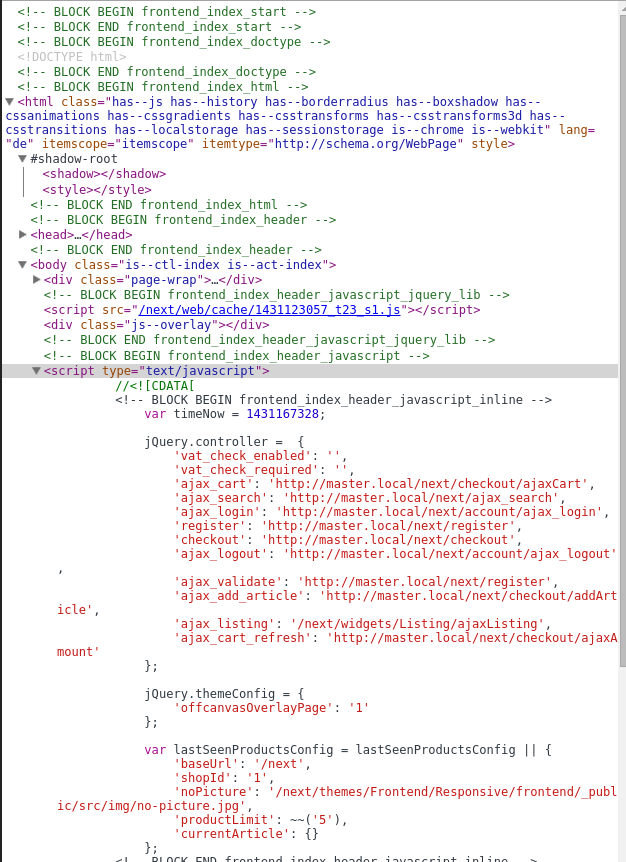

# DsnFrontendBlocks
Will show frontend blocks as HTML comments in the page's source code.

# Setting it up
* Install the plugin
* Create a cookie called `blocks` with any content you want
* Clear the cache from the backend
* Reload a frontend page

# What does it look like

# How does it work?
* Plugin registers a PreFilter in smarty
* Any template file will go through the `BlockAnnotator` which will split the blocks using the `BlockSplitter` class
* Blocks are sorted by nesting level and then replaced with their old content but a START and END HTML comment inside

# todos
* Add IP range or something similar
* Allow setting the cookie from the backend for more convenience
* Improve performance
* Recursive regex should already to the trick
* Perhaps add to developer toolbar
* 
 instead of HTML comment might allow some fancy hover effects
* file path might be useful, due to the inheritance structure, currently always the same file path would be shown 